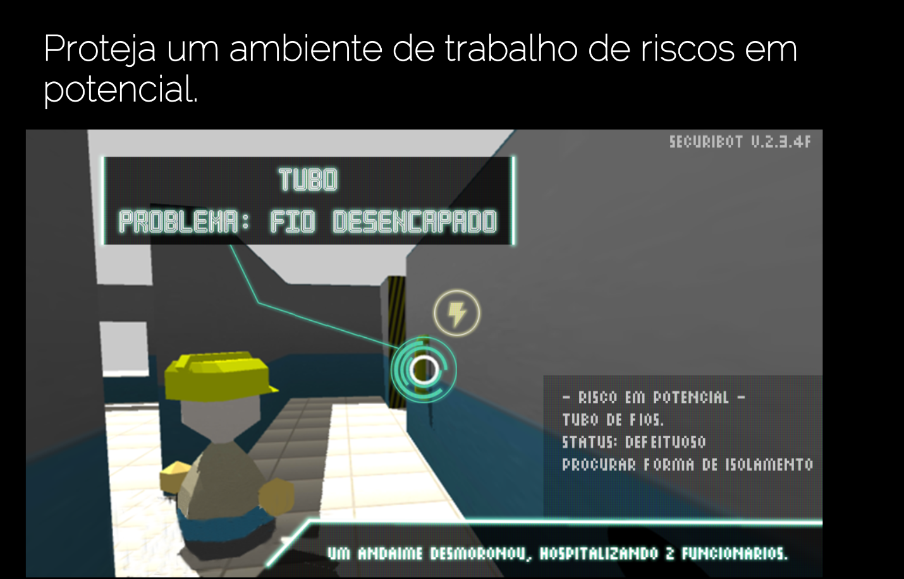

# SecuriBot Project
SecuriBot is an immersive challenge that deals with safety in the workplace. In the “skin” of an efficient robot, the player must search offices and construction areas with outrageously high risks of accidents and employees overly careless employees, in order to eliminate possible threats to the safety of site employees, and drawing the attention of employees whose carelessness can hurt them and others. 

# Requirements
- Generic Google Cardboard
- Bluetooth Controller

# Instruções de jogabilidade
- Analog stick - moves the character (back and forth)
- Button "A" - interacts with objects

# Technology references for development:
- Unity 3D 5.3.4f1
- VR Box Cardboard
- Google VR SDK

# Presentation Link:
http://prezi.com/glkoerskcrjf/?utm_campaign=share&utm_medium=copy

# Sound Effects
https://www.assetstore.unity3d.com/en/#!/content/54116
https://www.youtube.com/watch?v=o3lB97wuXOQ

# Bibliography
http://www.adm.ufba.br/sites/default/files/publicacao/arquivo/americo_diniz.pdf
http://www.fundacentro.gov.br/arquivos/projetos/estatistica/boletins/boletimfundacentro1vfinal.pdf
https://www.youtube.com/watch?v=-LPflHnfVdg

# References:
http://jobsimulatorgame.com/
http://www.surgeonsim.com/
http://www.dumbwaystodie.com/
